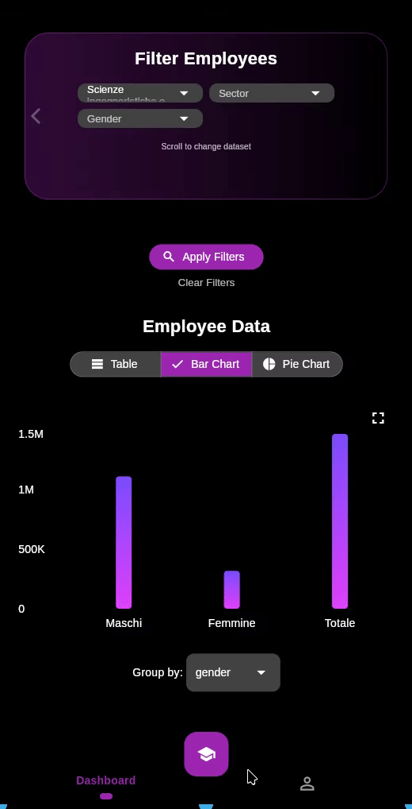
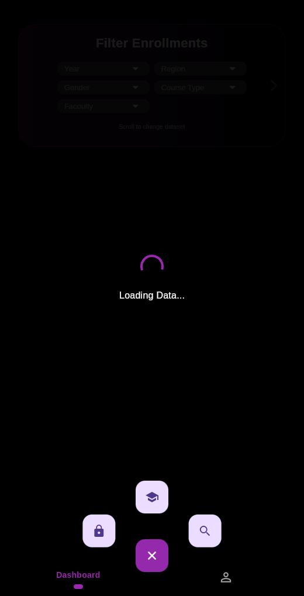
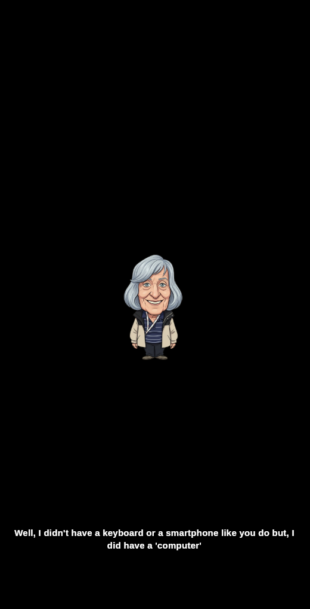
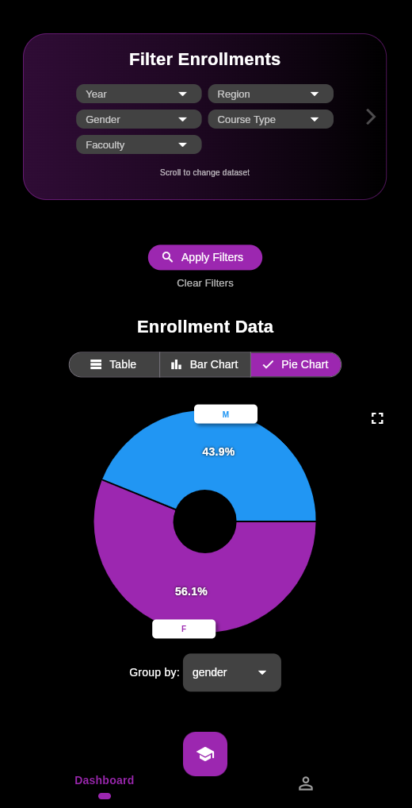
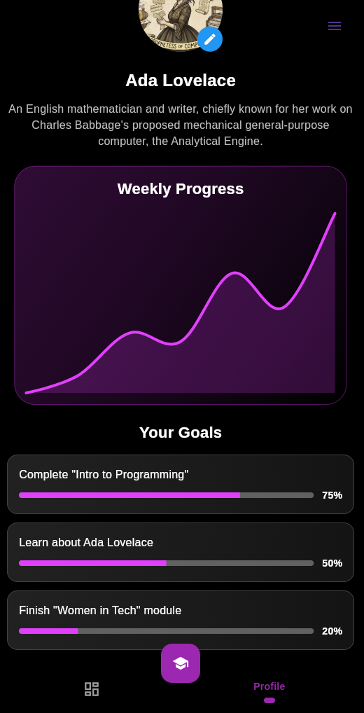

<div align="center">


# HackTheGapP

**Empowering the next generation of women in STEM.**


<p align="center">
  <a href="#-features">Features</a> •
  <a href="#-screenshots">Screenshots</a> •
  <a href="#-getting-started">Getting Started</a> •
  <a href="#-project-structure">Structure</a>
</p>

</div>

---

## 💡 About The Project

**HackTheGapP** is an application designed for female students (mid-grade / high school) to explore study paths free from stereotypes. The primary goal is to break down barriers regarding personal abilities and aptitudes, with a specific focus on **STEM** (Science, Technology, Engineering, and Mathematics) subjects.

> **Demo:**
>
> 

---

## 📱 Features

### 1. 👩‍🔬 BIG Minds' Stories (Interactive Mode)
The heart of the app. Users select a historical STEM figure (e.g., **Ada Lovelace**, **Margherita Hack**) and enter an interactive story.
* **Storytelling**: The character guides the user to solve a micro-problem related to their invention.
* **Philosophy**: No punitive "wrong answers." The goal is curiosity and empowerment.

### 2. 📊 Dashboard & Data Analysis
A visual tool providing insights into the job market and education landscape.
* **Profiling**: Visualizes aptitude (analytical-rational vs. pragmatic-creative).
* **Real Data**: Highlights gender gaps and enrollment statistics using real datasets.
* **Interactive Charts**: Filter data by Year, Region, and Gender via Bar and Pie charts.

### 3. 🏆 Gamification & Community
* **XP System**: Earn experience points by completing stories and exploring data.
* **Social**: (Coming Soon) Leaderboards and "Kahoot-style" classroom challenges.

### 4. 🧭 Orientation & Opportunities
* **Recommendations**: Directs users to schools/universities based on interests.
* **Integration**: Matches study topics with app stories.
* **Incentives**: Highlights scholarships and job offers promoting gender equality.

---

## 📸 Screenshots

| Home & Menu | Story Mode | Analytics Dashboard | Profile |
|:---:|:---:|:---:|:---:|
|  |  |  |  |

---

## 🛠 Project Structure

An overview of the key directories in the `lib` folder:

```text
lib/
├── main.dart              # 🏁 Entry point of the application
├── models/                # 📦 Data models (Stories, Employees, Enrollments)
├── screens/               # 📱 UI Screens
│   ├── dashboard.dart     # Data visualization logic
│   ├── profile.dart       # User progress tracking
│   ├── courses.dart       # Selection of historical figures
│   └── story_mode.dart    # Interactive storytelling UI
└── widgets/               # 🧩 Reusable UI components
    ├── character.dart     # Character avatars
    ├── typewriter.dart    # Animated text effects
    └── charts.dart        # Custom chart widgets
````

-----

## 🚀 Getting Started

Follow these steps to get a local copy up and running.

### Prerequisites

  * [Flutter SDK](https://flutter.dev/docs/get-started/install) (version \>=3.3.0)
  * Dart SDK

### Installation

1.  **Clone the repository**

    ```bash
    git clone 
    cd gender_hack
    ```

2.  **Install dependencies**

    ```bash
    flutter pub get
    ```

3.  **Run the app**

    ```bash
    flutter run
    ```

-----

## 🎮 Usage

1.  **Home**: Use the bottom navigation to switch between **Dashboard** and **Profile**. Tap the central button for **Courses**.
2.  **Courses**: Tap on a character (e.g., Ada Lovelace) to start her story.
3.  **Dashboard**: Use the filter chips (Year, Region) to update the charts. Toggle between Table, Bar, and Pie views.
4.  **Profile**: Check your weekly XP and set new goals.

-----

## 🤝 Contributing

Contributions are what make the open source community such an amazing place to learn, inspire, and create. Any contributions you make are **greatly appreciated**.

1.  Fork the Project
2.  Create your Feature Branch (`git checkout -b feature/AmazingFeature`)
3.  Commit your Changes (`git commit -m 'Add some AmazingFeature'`)
4.  Push to the Branch (`git push origin feature/AmazingFeature`)
5.  Open a Pull Request

-----

<div align="center">
<p><i>Made with ❤️ for the Hackathon<i\><p>
<div\>